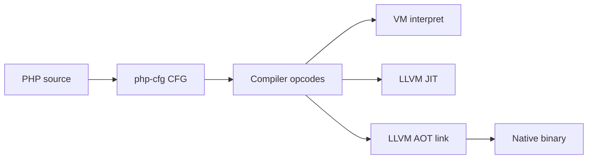

# php-compiler

> **AI-assisted project.** Most ongoing development, documentation, and tooling on this fork is **AI-heavy** (agent workflows, automated CI gates, bulk refactors). The **original idea and base architecture** — a PHP-in-PHP compiler with VM, JIT, and native compilation — come from [**Anthony Ferrara’s ircmaxell/php-compiler**](https://github.com/ircmaxell/php-compiler) (human-authored, MIT). Treat this repository as a maintained continuation, not a claim that every line was hand-written by a single author.

**Compile PHP to native binaries** — a CFG-based compiler with a bytecode **VM**, **LLVM 9 JIT**, and **AOT** linking. Ship CLI tools and small web apps that run **without Zend PHP at runtime** after `phpc build` or `phpc deploy`.

[](LICENSE)
[](https://www.php.net/)
[](https://llvm.org/)
[](https://purhur.github.io/php-compiler/docs/pages/index.html)

> **Stable line (2026)** — First maintained **stable** release **[v1.0.0](https://github.com/PurHur/php-compiler/releases/tag/v1.0.0)**; **v1.1.0** prep adds M5 fast-path stability, enum/property-hook parity, `preg_match` JIT, `spl_autoload*`, and php-in-PHP JIT helpers. Demo-ready VM + AOT for a **web-capable PHP subset**, reference examples **000–009**, and an experimental **self-host** path. Not full Zend PHP compatibility — see [what’s missing](https://purhur.github.io/php-compiler/docs/pages/missing-implementation.html).

**Snapshot (Jun 2026, `master` — v1.1.0 prep):** VM + AOT for shipped examples ✅ · examples web smoke ✅ · self-host spine **3487**/**3487** · **852** builtins · M5 fast + strict ✅ · VM probe ~**20ms**

---

## Current implementation status (June 2026)

| Area | State | Notes |
|------|--------|--------|
| **VM (`phpc run`)** | ✅ Production-shaped for dev/CI | Broadest language coverage; reference executor and JIT/AOT fallback |
| **AOT (`phpc build`)** | ✅ For curated subset | Standalone binaries for examples **000–009** and small CGI apps; not arbitrary Composer stacks |
| **JIT (`bin/jit.php`)** | 🚧 Partial | LLVM IR for many constructs; **MCJIT execute** still flaky ([#98](https://github.com/PurHur/php-compiler/issues/98)); EH scripts VM-fallback ([#2114](https://github.com/PurHur/php-compiler/issues/2114)) |
| **Language wave 3** | ✅ Closed batch | **12/12** language + **13/13** stdlib tracker items ([#1380](https://github.com/PurHur/php-compiler/issues/1380)); closures, try/catch, generators (VM), `parent::class`, backed enums (VM), intersection AOT checks |
| **Self-host north star** | ✅ ~90% | M5 fast gate green; spine **3487**/**3487**; vendor prelink **3/3** ([#1492](https://github.com/PurHur/php-compiler/issues/1492)) |

### What you can rely on today

- **`phpc` CLI** — `run`, `serve`, `build`, `deploy`, `lint`, `test`, `init`, `doctor` on the **web-capable PHP 8 subset** documented in [`docs/capabilities-syntax.md`](docs/capabilities-syntax.md).
- **Examples 000–009** — VM smoke green via `./phpc test --fast`; AOT link/execute when LLVM 9 is present (`make examples-aot-smoke`).
- **003-MiniWebApp** — router, templates, forms, JSON API; native AOT execute on supported routes.
- **009-FastCGIWeb** — FastCGI record codec + VM listener ([#3261](https://github.com/PurHur/php-compiler/pull/3261)).
- **Local/Docker CI** — merge gates run on the host or in `php-compiler:22.04-dev` (remote GHA disabled on this fork).

### Self-host ladder (experimental)

Counts from `php script/bootstrap-spine-count.php` (literal `require_once` in `compiler_lib_spine_smoke` vs Phase A inventory).

| Milestone | Status | What it means |
|-----------|--------|----------------|
| **M0–M1** | ✅ | `compiler_minimal` + compile-smoke bundles link and run natively |
| **M2** | ✅ **3487**/**3487** | Full Phase A inventory in spine smoke; native link + lint ✅ |
| **M3** | ✅ | HelloWorld strict native ✅; inventory argv `bin/compile.php` ✅ |
| **M4** | ✅ | `make bootstrap-loop-probe` full ladder ✅ (gen-1→gen-2→gen-3 + full-revision) |
| **M5** | ✅ | `make north-star5-verify-fast` (daily); `--strict` pre-merge ✅; vendor **3/3** ✅; gen-0 sidecars refreshed |

**Reproduce M0 smoke on a clean clone (verified Jun 2026):**

```bash
make docker-build-22   # once
./script/docker-exec.sh -- bash -lc \
  'composer install --ignore-platform-reqs -q \
   && script/apply-patches.sh \
   && make bootstrap-selfhost-link'
./build/selfhost   # → compiler_minimal bundle OK
```

Deeper ladder: [`docs/bootstrap-selfhost.md`](docs/bootstrap-selfhost.md) · [`docs/bootstrap-m5-fast-path.md`](docs/bootstrap-m5-fast-path.md) · [`docs/GETTING-STARTED.md` §6–7](docs/GETTING-STARTED.md) · `make north-star5-verify-fast` · `make bootstrap-loop-probe`.

**Fast iteration (LLVM/JIT / M5 daily):** `make north-star5-verify-fast` (~1–2 min) · `make bootstrap-selfhost-vm-driver-execute-probe` (~20ms) · `php script/bootstrap-inventory.php --check` (seconds). Full spine relink only after editing `compiler_lib_spine_smoke/main.php` or with `BOOTSTRAP_VM_DRIVER_EXECUTE_PROBE_FULL_LINK=1`. **`north-star5-verify --strict`** (~1h) only before merging bootstrap/gen-0/vendor work.

### Still open (high signal)

- **Not Zend PHP** — no full `ext-*` ecosystem, frameworks, or unmodified Composer apps at AOT runtime
- **Generator / enum native AOT** — VM yes; native lowering open ([#3074](https://github.com/PurHur/php-compiler/issues/3074), [#3076](https://github.com/PurHur/php-compiler/issues/3076))
- **JIT MCJIT execute** — SIGSEGV in probe ([#98](https://github.com/PurHur/php-compiler/issues/98))
- **Fresh host PHP 8.3+** — use `composer install --ignore-platform-reqs` or Docker; locked dev deps target PHP 8.1–8.2

Live matrices: [status site](https://purhur.github.io/php-compiler/docs/pages/index.html) · [development status](https://purhur.github.io/php-compiler/development-status.html) · [gap tables](https://purhur.github.io/php-compiler/docs/pages/missing-implementation.html).

---

## Lineage & disclaimer

This repository continues work that began as a **research compiler written in PHP**:

| | |
|---|---|
| **Original project** | [**ircmaxell/php-compiler**](https://github.com/ircmaxell/php-compiler) on GitHub |
| **Original author** | [**Anthony Ferrara**](https://github.com/ircmaxell) (`ircmaxell`) — idea, early architecture, and MIT-licensed codebase ([LICENSE](LICENSE)) |
| **This fork** | [**PurHur/php-compiler**](https://github.com/PurHur/php-compiler) — LLVM-backed JIT/AOT, `phpc` CLI, web examples, bootstrap/self-host ladder, and ongoing maintenance |

**Disclaimer:** The *concept* of a PHP-in-PHP compiler with VM, JIT, and native compilation comes from Anthony Ferrara’s original project. This fork is a **separate continuation** with substantial new code, tooling, and goals (especially self-host and production-shaped `phpc` workflows). It is **not** an official release from the original author unless stated otherwise. If you cite the idea, please credit the [original repository](https://github.com/ircmaxell/php-compiler) and its author.

---

## What is php-compiler?

Most PHP runs on **Zend** (opcode VM in C). **php-compiler** takes a different path:

1. **Parse** PHP with [php-cfg](https://github.com/ircmaxell/php-cfg) into a control-flow graph (CFG).
2. **Lower** the CFG to internal opcodes (`lib/Compiler.php`).
3. **Execute** via one of three backends:

| Backend | Entry | Role |
|---------|--------|------|
| **VM** | `phpc run`, `bin/vm.php` | Interpreter loop in PHP — correct, flexible, slower |
| **JIT** | `bin/jit.php` | LLVM MCJIT — compile at startup, then run native code |
| **AOT** | `phpc build`, `bin/compile.php` | Link a **standalone executable** — no Zend at runtime |



The project targets a **deliberate subset** of PHP 8.x oriented toward **CLI and CGI-style web apps** (superglobals, routing, templates, sessions, uploads, JSON APIs) — not every language feature or extension Zend provides.

**Active research direction:** [**self-host**](https://github.com/PurHur/php-compiler/issues/1492) — the compiler compiling its own `lib/` tree into native binaries without relying on Zend in the bootstrap loop. Shipped examples under [`examples/`](examples/) (e.g. [MiniWebApp](examples/003-MiniWebApp/)) are **integration test fixtures** for that stack, not a separate product.

---

## Try it in five minutes

**Needs:** PHP **8.1+**, Composer. LLVM **9** only for `build`, JIT, and full CI (not for `phpc test --fast`).

```bash
git clone https://github.com/PurHur/php-compiler.git
cd php-compiler
composer install
./phpc test --fast
```

| Step | Command | What you see |
|------|---------|----------------|
| **Hello, native** | `./phpc build -o /tmp/hello examples/000-HelloWorld/example.php && /tmp/hello` | Standalone executable, no `php` at runtime |
| **Web app (VM)** | `./phpc serve examples/003-MiniWebApp` → open `http://127.0.0.1:8080/` | Router, templates, JSON API |
| **Self-host smoke (M0)** | Docker: see [Current implementation status](#current-implementation-status-june-2026) | `compiler_minimal bundle OK` (needs LLVM 9 + patches) |

Presenter walkthrough: [`docs/GETTING-STARTED.md`](docs/GETTING-STARTED.md) · public overview: [status site](https://purhur.github.io/php-compiler/docs/pages/index.html).

---

## The `phpc` CLI

[`./phpc`](bin/phpc.php) is the unified developer interface (legacy `bin/vm.php`, `bin/jit.php`, `bin/compile.php` still work).

| Command | Purpose |
|---------|---------|
| `phpc run` | Run a script on the VM (`-q` / `-p` for CGI-style superglobals) |
| `phpc serve` | Dev HTTP server (VM); `phpc serve --aot` serves a prebuilt binary |
| `phpc build` | AOT compile to a native executable; `--project` uses `phpc.json` |
| `phpc deploy` | Package binary + `public/` into a deploy tree |
| `phpc lint` | Report unsupported syntax in a file or tree |
| `phpc test` | Run CI (`--fast` = VM/compliance only, no LLVM) |
| `phpc init` | Scaffold `phpc.json` (`--profile miniwebapp`, `sessionsweb`, `fileupload`) |
| `phpc doctor` | Environment and gate probes |

```bash
./phpc help
./phpc run -r 'echo "Hello\n";'
./phpc build -o .phpc/bin/app examples/001-SimpleWeb/example.php
./phpc serve examples/001-SimpleWeb
```

Manifest format: [`docs/phpc-json.md`](docs/phpc-json.md) · AOT deploy quickstart: [`docs/deploy-web-aot.md`](docs/deploy-web-aot.md) · Production guide: [`docs/deploy-production.md`](docs/deploy-production.md).

---

## Example applications

Reference apps live under [`examples/`](examples/). They prove VM, AOT link, native execute, and deploy paths — see [`examples/README.md`](examples/README.md).

| Example | Highlights |
|---------|------------|
| [000–002](examples/000-HelloWorld/) | CLI hello, simple web, CGI query params |
| [003-MiniWebApp](examples/003-MiniWebApp/) | Router, templates, contact form, JSON API — native execute ✅ |
| [004-ApiJson](examples/004-ApiJson/) | JSON API |
| [005-SessionsWeb](examples/005-SessionsWeb/) | `session_start`, flash messages |
| [006-FileUploadWeb](examples/006-FileUploadWeb/) | Multipart `$_FILES` |
| [007-ThrowsWeb](examples/007-ThrowsWeb/) | Caught exceptions in forms |
| [008-SelfHostProbe](examples/008-SelfHostProbe/) | Self-host presenter probe |
| [009-FastCGIWeb](examples/009-FastCGIWeb/) | FastCGI-oriented layout (adapter [#173](https://github.com/PurHur/php-compiler/issues/173); fixture SSOT [#2331](https://github.com/PurHur/php-compiler/issues/2331)) |

```bash
make web-smoke              # lint + VM smoke on shipped examples
make examples-aot-smoke     # AOT link + execute (when LLVM is ready)
make examples-web-smoke     # phpc serve + HTTP curls
```

---

## Capabilities & limitations

php-compiler is **not** a drop-in Zend PHP replacement. It implements a **web-capable PHP 8 subset** aimed at small CLI/CGI apps, native deployment, and (experimentally) compiling its own `lib/` tree. Capabilities differ by backend — **VM**, **JIT**, and **AOT** do not always match.

| Column | Meaning |
|--------|---------|
| **VM** | Runs under `phpc run` / `bin/vm.php` — broadest language coverage, slowest |
| **JIT** | `bin/jit.php` — native code via LLVM MCJIT; some CFGs fall back to VM |
| **AOT** | `phpc build` — standalone binary; strictest; many features blocked at link time |

Full matrices (auto-generated): [`docs/capabilities.md`](docs/capabilities.md) (builtins) · [`docs/capabilities-syntax.md`](docs/capabilities-syntax.md) (language) · public [gap tables](https://purhur.github.io/php-compiler/docs/pages/missing-implementation.html) · [PHP vs us](https://purhur.github.io/php-compiler/docs/pages/capability-comparison.html).

### What v1.0+ supports well

**Language & OOP (typical app code)**

- Classes, `new`, interfaces, `instanceof`, constructors, visibility, promoted properties, `readonly` classes
- **Property hooks** (PHP 8.4) — get/set hooks on VM with backing storage, `??`/`unset` semantics ([#6426](https://github.com/PurHur/php-compiler/issues/6426), [#8902](https://github.com/PurHur/php-compiler/issues/8902))
- Instance and static methods, `parent::class` / `parent::$prop`, late static binding, magic constants
- Namespaces, `use function` / `use const`, group `use`
- `match`, scalar `declare(strict_types=1)`, union types; intersection types with AOT call-site checks ([#3103](https://github.com/PurHur/php-compiler/pull/3103))
- **Closures** and **arrow functions** on VM and JIT (LLVM IR): `use ($var)` by-value and by-ref ([#3108](https://github.com/PurHur/php-compiler/pull/3108)), indirect `$arr[0]()` invoke ([#3092](https://github.com/PurHur/php-compiler/pull/3092))
- **`try` / `catch` / `finally`** on VM including return-through-finally ([#3106](https://github.com/PurHur/php-compiler/pull/3106)); JIT EH IR verified ([#3107](https://github.com/PurHur/php-compiler/pull/3107)) — `bin/jit.php` still VM-fallback for EH scripts
- **Generators** (`yield`, keyed yield, `yield from`) on VM; JIT/AOT use VM fallback ([#3085](https://github.com/PurHur/php-compiler/pull/3085))
- **Backed enums** on VM — `from`/`tryFrom`, case methods, strict builtins ([#3091](https://github.com/PurHur/php-compiler/pull/3091)); traits — simple `use Trait;`
- Attributes — reflection read path (`getAttributes()`, name only)

**Web & deployment**

- CGI-style superglobals (`$_GET`, `$_POST`, `$_SERVER`, `$_FILES`, `$_COOKIE`, `$_SESSION`)
- `phpc serve` dev server and `phpc serve --aot` for prebuilt binaries
- Sessions, multipart uploads, JSON APIs — examples **005–007**
- `phpc build`, `phpc deploy`, `phpc.json` project manifests — see [deploy-production.md](docs/deploy-production.md)
- Reference **003-MiniWebApp**: router, templates, forms, native AOT execute on supported routes

**Standard library (v1.1.0 prep — Jun 2026)**

- **852** builtins in the auto-generated matrix — strings, arrays, JSON, `preg_*`, filesystem, streams, bcmath, mbstring
- v1.1.0 batch: **`preg_match` / `preg_match_all` JIT**, **`spl_autoload*`** stack, enum-aware strict builtins, php-in-PHP `proc_open` paths
- Core VM additions: `class_uses`, `class_alias`, `get_debug_type`, `iterator_to_array`, `array_chunk` (preserve keys), `settype`, `array_replace_recursive`, `json_validate`, `preg_last_error_msg`, `fdiv`, **DateTime** / **DateTimeZone** OOP ([#3104](https://github.com/PurHur/php-compiler/pull/3104))
- **`array_map` / `array_filter` / `usort`** accept **closure** callbacks on VM ([#3086](https://github.com/PurHur/php-compiler/pull/3086))
- Wave 3 tracked batch: **12/12** language + **13/13** stdlib items closed; ongoing parity work tracked in [#1380](https://github.com/PurHur/php-compiler/issues/1380) follow-ups

**Tooling**

- `phpc lint` — scan trees for unsupported syntax before compile
- `phpc doctor` — environment and example gate probes
- Native vendor invoker surfaces `parseAndCompile` failure text ([#3084](https://github.com/PurHur/php-compiler/pull/3084))
- Local/Docker CI: `phpc test`, `phpc test --fast`

### Known limitations

**Language (subset gaps)**

| Area | VM | JIT / AOT | Notes |
|------|:--:|:---------:|-------|
| `try` / `catch` / `finally` | Yes (compliance) | JIT IR only; execute → VM | MCJIT EH unsafe ([#2114](https://github.com/PurHur/php-compiler/issues/2114)); `bin/jit.php` uses `requiresVmLowering` |
| Closures / arrow `fn () =>` | Yes | JIT IR verify | Self-host / bootstrap may stub `null`; `bin/jit.php` MCJIT execute still flaky ([#98](https://github.com/PurHur/php-compiler/issues/98), [#72](https://github.com/PurHur/php-compiler/issues/72)) |
| Generators (`yield`) | Yes | VM fallback | Native JIT/AOT lowering open ([#167](https://github.com/PurHur/php-compiler/issues/167), [#3074](https://github.com/PurHur/php-compiler/issues/3074)) |
| By-ref **parameters** (`function f(&$x)`) | Yes | No JIT | Distinct from closure `use (&$x)` ([#140](https://github.com/PurHur/php-compiler/issues/140)) |
| Enums in AOT | VM/JIT | No | [#1356](https://github.com/PurHur/php-compiler/issues/1356), [#3076](https://github.com/PurHur/php-compiler/issues/3076) |
| Full trait adaptation (`insteadof` / `as`) | Partial | Gaps | [#144](https://github.com/PurHur/php-compiler/issues/144) |
| Fibers | No | No | [#3130](https://github.com/PurHur/php-compiler/issues/3130) |

**Runtime & platform**

- **Not Zend-compatible** — no `ext-*` ecosystem, no Composer autoload at AOT runtime, no `eval()`, no full reflection beyond supported paths
- **LLVM 9 only** — JIT/AOT tied to bundled toolchain; upgrading LLVM is non-trivial
- **JIT compile cost** — recompiles on each `bin/jit.php` run; not a long-lived FPM replacement
- **Performance** — AOT can be fast; VM path is PHP-on-PHP; see [`benchmarks/`](benchmarks/)
- **Security model** — same trust as running native code; no sandbox; body size limits on `phpc serve` (default 8 MiB)

**Self-host (experimental, not “stable app” scope)**

See [Current implementation status](#current-implementation-status-june-2026) for the full M0–M5 ladder. Summary: M0–M5 bootstrap gates ✅; spine **3487**/**3487**; M3 strict native + inventory argv ✅; M4 full `bootstrap-loop-probe` ✅; M5 **`north-star5-verify-fast`** (daily) + **`--strict`** pre-merge ✅ ([#1492](https://github.com/PurHur/php-compiler/issues/1492), [#8559](https://github.com/PurHur/php-compiler/issues/8559)). Recent: native spine bundle probe, fast VM execute smoke ([#2201](https://github.com/PurHur/php-compiler/issues/2201)), `GeneratorYieldSourceMarker` spine unit ([#10356](https://github.com/PurHur/php-compiler/pull/10356)).

**What we do not target in v1.x**

- Running arbitrary Composer packages unmodified
- WordPress, Laravel, Symfony, or full framework stacks
- pthreads, fibers, or parallel extension semantics
- Every PHP 8.3+ feature as Zend ships it

### Check your code before shipping

```bash
./phpc lint path/to/your-app.php
./phpc lint --project .          # uses phpc.json roots
./phpc build -o /tmp/app entry.php   # fails early on unsupported constructs
```

Regenerate maintainer matrices after builtin changes: `php script/capability-matrix.php` and `php script/capability-syntax.php`.

**Live status:** [Overview](https://purhur.github.io/php-compiler/docs/pages/index.html) · [Development status](https://purhur.github.io/php-compiler/development-status.html).

---

## Installation

### Host (recommended for daily dev)

- **PHP 8.1+** (8.2 recommended): `tokenizer`, `mbstring`, `dom`, `xml`, `xmlwriter`, `ffi`, `posix`, `phar`
- **Composer**
- **LLVM 9** for JIT/AOT — bundled into `.llvm/` by `./script/install-llvm9.sh` or first `./script/ci-local.sh`
- **LLVM 14** (opt-in migration, [#174](https://github.com/PurHur/php-compiler/issues/174)) — `./script/install-llvm14.sh` installs to `.llvm14/`; default CI still uses LLVM 9 until PHPLLVM llvm14 FFI lands

```bash
composer install --ignore-platform-reqs   # if host PHP is 8.3+ (locked deps target 8.1–8.2)
script/apply-patches.sh    # php-cfg overlays; required before compile
./script/install-llvm9.sh  # optional until you run full CI or phpc build
# ./script/install-llvm14.sh  # opt-in LLVM 14 tree (.llvm14/); see docs/local-ci-matrix.md
```

### Docker-only hosts

```bash
make docker-build-22   # once: php-compiler:22.04-dev
make test              # full CI inside container
```

On Runforge/harness sandboxes use `make test-harness` or `./script/docker-ci-local.sh` — see [Troubleshooting](#troubleshooting).

### Environment variables (common)

| Variable | Purpose |
|----------|---------|
| `PHP_COMPILER_PHP` | PHP binary for tests (default `php` or `php8.2`) |
| `PHP_COMPILER_LLVM_PATH` | LLVM tree (default: repo `.llvm/` for LLVM 9; opt-in `.llvm14/` after [#174](https://github.com/PurHur/php-compiler/issues/174) FFI) |
| `PHP_COMPILER_LLVM14_INSTALL_DIR` | LLVM 14 install target (default: repo `.llvm14/`) |
| `PHP_COMPILER_SKIP_SERVE_TESTS` | Skip HTTP tests when loopback bind fails |
| `PHP_COMPILER_DEBUG` | Verbose errors on `phpc serve` (500 responses) |

Full list: run `./phpc doctor` or see the [local CI matrix](docs/local-ci-matrix.md).

---

## Development & quality gates

Merge quality is enforced **locally or in Docker** (GitHub Actions / CircleCI are disabled on this fork).

| Goal | Command |
|------|---------|
| Fast iteration | `./phpc test --fast` or `./script/ci-fast.sh` |
| Full gate | `./script/ci-local.sh` or `make test` |
| Bootstrap / self-host | `make bootstrap-selfhost-link`, `make north-star4-verify`, `make bootstrap-wave-check` |

Contributor matrices (regenerate when builtins change):

```bash
php script/capability-matrix.php
php script/capability-syntax.php
```

Deep docs: [`docs/README.md`](docs/README.md) · self-host: [`docs/self-host-target.md`](docs/self-host-target.md) · bootstrap gates: [`docs/bootstrap-selfhost.md`](docs/bootstrap-selfhost.md) · CI matrix: [`docs/local-ci-matrix.md`](docs/local-ci-matrix.md).

---

## Three ways to run code (internals)

### VM — virtual machine

The VM ([`lib/VM.php`](lib/VM.php)) is a classic decode-and-dispatch loop over compiler opcodes. It is the **reference executor** and the fallback when JIT/AOT cannot lower a construct yet. Running PHP on this VM is slower than Zend, but it is how most development and compliance tests run.

### JIT — just-in-time

[`bin/jit.php`](bin/jit.php) lowers opcodes to LLVM IR, uses MCJIT, and jumps into generated machine code. Compile time is significant; some CFG shapes (generators, unstable exception lowering) still fall back to the VM.

### AOT — ahead-of-time

[`bin/compile.php`](bin/compile.php) / `phpc build` emits object code and links a **native executable** with the project runtime ([`lib/AOT/`](lib/AOT/), [`lib/Runtime.php`](lib/Runtime.php)). This is the deployment path for “no PHP installed on the server.”

Debug CFG and opcodes: `php bin/print.php -r 'echo 1;'`

---

## Contributing

**We do not accept drive-by GitHub issues or pull requests** without prior coordination. Contact maintainers on other channels first and align with the AI-agent workflow. Forks are welcome under MIT — see [CONTRIBUTING.md](CONTRIBUTING.md).

---

## Troubleshooting

| Symptom | Fix |
|---------|-----|
| Empty repo inside Docker on harness | `make test-harness` or `./script/docker-ci-local.sh` (tar copy) |
| `libLLVM-9.so.1: cannot open` | `./script/install-llvm9.sh` or set `LD_LIBRARY_PATH` to `.llvm/` |
| Parser/lexer errors on PHP 8.2+ | `composer install` + `script/apply-patches.sh` |
| AOT link failures | Re-run `script/install-llvm9.sh`; check `PHP_COMPILER_LLVM_PATH` |

More: [`docs/GETTING-STARTED.md`](docs/GETTING-STARTED.md) · [`docs/local-ci-matrix.md`](docs/local-ci-matrix.md).

---

## License

[MIT](LICENSE) — see [Lineage & disclaimer](#lineage--disclaimer) for attribution to the original project.

---

## Links

| Resource | URL |
|----------|-----|
| **This repository** | https://github.com/PurHur/php-compiler |
| **Original project** | https://github.com/ircmaxell/php-compiler |
| **Status & gaps (GitHub Pages)** | https://purhur.github.io/php-compiler/ |
| **Anthony Ferrara (original author)** | https://github.com/ircmaxell |
| **Benchmarks** | [`benchmarks/`](benchmarks/) (`make bench`) |
